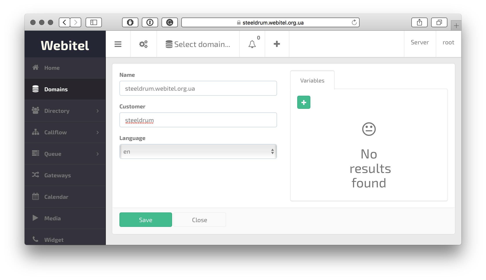
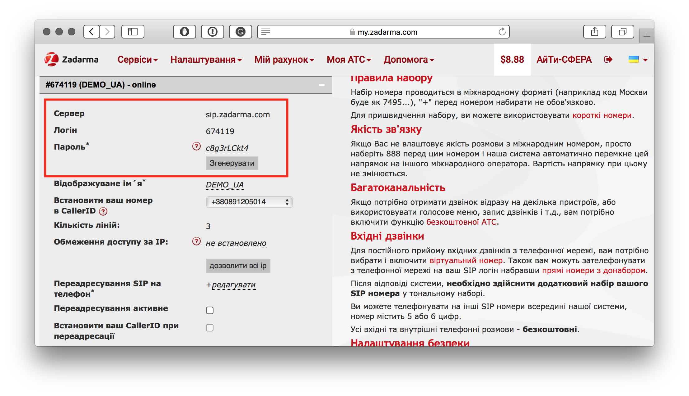
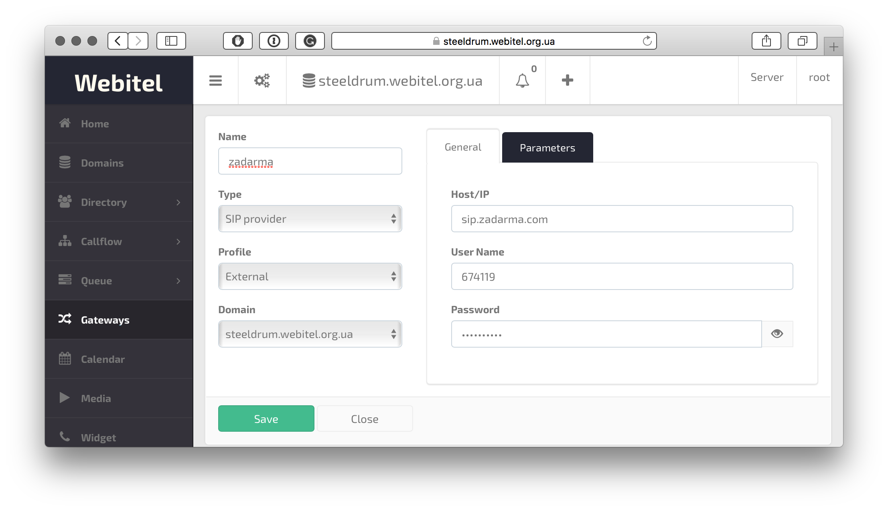
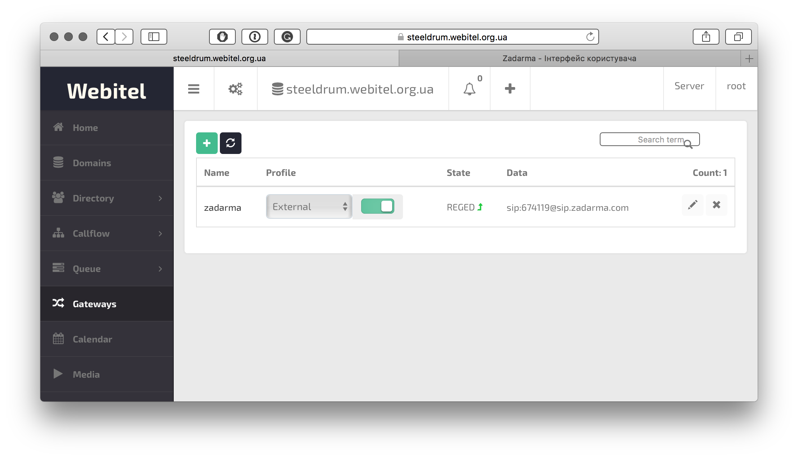

% webitel
% Віталій Ковалишин
% Травень 19, 2018

~~~~~~~~~~~~~~~~~~~~~~~~~~~~~~~~~~~~~~~~~~ {.textinfo}
 ________________________________________
( Розгортання та                         )
( налаштування власної                   )
( хмарної АТС Webitel                    )
 ----------------------------------------
  \
   \   \_\_    _/_/
    \      \__/
           (oo)\_______
           (__)\       )\/\
               ||----w |
               ||     ||
~~~~~~~~~~~~~~~~~~~~~~~~~~~~~~~~~~~~~~~~~~~~

- За 25 хвилин

#
### 00:00:00 
 - Нашу рефералку [ТИЦ](https://m.do.co/c/e56e7c26e8f3)

#
### 00:02:00 

#
### 00:04:00 

#
### 00:05:00 

#
### 00:08:00

~~~~~~~~~~~~~~~~~~~~~~~~~~~~~~~~~~~~~~~~~~ {.bash .numberLines}
cd /opt
sudo git clone https://github.com/webitel/orchestration.git
cd orchestration
cat /opt/orchestration/etc/sysctl.conf >> /etc/sysctl.conf
sysctl -p
cp etc/ufw/applications.d/webitel-server /etc/ufw/applications.d/
ufw allow webitel
./bin/bootstrap.sh pull
~~~~~~~~~~~~~~~~~~~~~~~~~~~~~~~~~~~~~~~~~~~~

#
### 00:10:00 

#
### 00:11:00
~~~~~~~~~~~~~~~~~~~~~~~~~~~~~~~~~~~~~~~~~~ {.bash .numberLines}
vi env/environment
cp /opt/orchestration/etc/cron.d/webitel /etc/cron.d/
./bin/reebot.sh
~~~~~~~~~~~~~~~~~~~~~~~~~~~~~~~~~~~~~~~~~~~~

#
### 00:11:00 

#
### 00:12:00 

#
### 00:13:00
~~~~~~~~~~~~~~~~~~~~~~~~~~~~~~~~~~~~~~~~~~ {.bash .numberLines}
./bin/bootstrap.sh letsencrypt
vi env/environment
./bin/reebot.sh
~~~~~~~~~~~~~~~~~~~~~~~~~~~~~~~~~~~~~~~~~~~~

#
### 00:15:00 

#
### 00:19:00 

#
### 00:21:00 
 - Нашу рефералку [ТИЦ](https://zadarma.com/?ref=0c6f2237dab98e500eeb8fb8a1d63d80)

#
### 00:24:00 

#
### 00:25:00 

